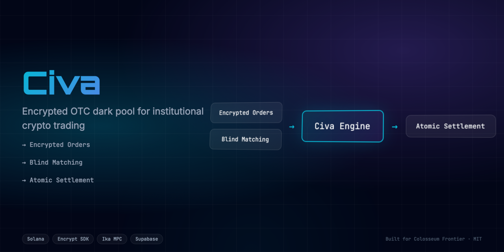

<div align="center">
  <h1>Civa 🔐</h1>
  <p><em>Hide your trades. Settle atomically. Zero MEV. Institutional-grade OTC dark pool protocol using Encrypt SDK for encrypted state and Ika Custody for bridgeless atomic settlement. Audited by Adevar Labs.</em></p>
  

  <br/>
  <br/>

  [](https://civa.edycu.dev)
  [](https://youtube.com/watch?v=DEMO_VIDEO)
  [](https://civa.edycu.dev/pitch)
  [](https://superteam.fun/earn/listing/50k-adevarlabs-bounty)

  <br/>

  [](https://nextjs.org)
  [](https://solana.com)
  [](https://typescriptlang.org)
  [](LICENSE)
  [](https://github.com/edycutjong/civa/actions/workflows/ci.yml)

</div>

---

## 📸 See it in Action

<div align="center">
  
</div>

> **Institutional-grade dark pool.** Hide your trades. Settle atomically. Zero MEV.

---

## 🎯 Problem

Large-scale crypto trades on public DEXs are fundamentally broken for institutional participants:

- **MEV Extraction** — Bots front-run and sandwich large orders, extracting $1.4B+ in 2025
- **Market Impact** — A $2M sell on a public AMM moves price 2-5%, costing tens of thousands in slippage
- **Identity Exposure** — On-chain analysis links wallets to real identities; competitors see your positions
- **No On-Chain OTC** — Traditional desks are custodial, slow (T+1), and KYC-gated

The crypto OTC market exceeds **$100B annually**, yet there is no privacy-preserving, non-custodial OTC protocol on Solana.

## 💡 Solution

**Civa (CipherVault)** provides an encrypted OTC dark pool in the **DeFi** category:

1. 🔒 **Makers post encrypted offers** — lock assets in vault PDAs, trade params encrypted via Encrypt SDK
2. 👁️ **Takers match blindly** — browse liquidity bands ($1M-$5M) without seeing exact amounts
3. ⚡ **Atomic settlement** — Ika Custody executes simultaneous swap, zero custodial risk
4. 🛡️ **Post-trade privacy** — settlement reveals only net transfer, not order sizes or parties

**Entire flow: order → settlement in under 10 seconds. 100% on-chain.**

---

## 🏗️ Architecture & Tech Stack

| Layer | Technology |
|---|---|
| **Frontend** | Next.js 16 (App Router), React 19 |
| **Styling** | Tailwind CSS v4 |
| **Encryption** | Encrypt SDK (confidential tokens, ZKP) |
| **Settlement** | Ika Custody (bridgeless atomic swap) |
| **Blockchain** | Solana Devnet |
| **Audit** | Adevar Labs Security Credits |
| **Deploy** | Vercel |

> 📐 **[Full architecture deep-dive →](docs/ARCHITECTURE.md)** — System diagram, matching flow, and encryption details.

---

## 🚀 Quick Start

```bash
# Clone
git clone https://github.com/edycutjong/civa.git
cd civa

# Install
npm install

# Configure environment
cp .env.example .env.local
# Fill in: ADEVAR_API_KEY (optional — demo mode works without keys)

# Run
npm run dev
```

Open [http://localhost:3000](http://localhost:3000) — the hero page loads with full animation suite.

### Environment Variables

| Variable | Required? | Where to Get |
|----------|-----------|--------------|
| `NEXT_PUBLIC_ADEVAR_API_URL` | Optional | [Encrypt SDK](https://docs.encrypt.network) — defaults to demo endpoint |
| `ADEVAR_API_KEY` | Optional | Not required (No developer portal for Ika yet) |

> **💡 Note for Judges (Where to get the API key?):** 
> The variable is named `ADEVAR_API_KEY` after the track sponsor, but it is actually intended for the Encrypt SDK / Ika backend. Because a public developer portal does not exist yet, **you do not need an API key.** All API keys are **100% optional**. If left blank, the app will automatically fall back to generating mock ZK proofs so you can test the entire flow uninterrupted.

---

## 📱 User Flow

### 1. Landing Page
Premium glassmorphism hero with particle canvas, orbital rings, animated counters, and mesh gradient background. Floating sponsor badges (Encrypt, Ika, Adevar) and staggered entrance animations.

### 2. Trading Terminal
Create encrypted OTC offers with asset selection, amount input (encrypted on-chain), and visible liquidity band (ZKP). Real-time ZK proof generation simulation.

### 3. Dark Pool Liquidity
Browse available encrypted orders showing only visible bands. Order IDs, asset types, and status — all trade details hidden via zero-knowledge proofs.

### 4. Privacy Gap Comparison
Split-screen view: **Public Explorer** (encrypted gibberish) vs **Civa Dark Desk** (decrypted view). Demonstrates the privacy advantage for authorized participants.

---

## 📂 Project Structure

```
src/
├── app/
│   ├── page.tsx                         # Hero + Dashboard
│   ├── about/page.tsx                   # Project documentation
│   ├── layout.tsx                       # Root layout + fonts
│   ├── globals.css                      # Design system + animations
│   └── api/health/                      # Health check endpoint
├── components/
│   ├── HeroSection.tsx                  # Animated hero with particles
│   ├── StatusBar.tsx                    # Network status bar
│   ├── Footer.tsx                       # Portfolio footer
│   ├── OrderCreator.tsx                 # Encrypted order form
│   ├── LiquidityBoard.tsx              # Dark pool order table
│   └── ComparisonSplitScreen.tsx        # Public vs Private view
├── lib/
│   └── adevar.ts                        # Encrypt/Ika SDK client
docs/
├── ARCHITECTURE.md                      # System architecture
└── readme-hero.png                      # Hero banner image
```

---

## 🎨 Design System

| Token | Value | Usage |
|-------|-------|-------|
| Background | `#020617` | App background (Slate 950) |
| Surface | `#0a0f1e` | Cards, panels |
| Primary | `#06b6d4` | Encrypt/Ika accent (Cyan) |
| Accent | `#8b5cf6` | Ika/secondary (Purple) |
| Success | `#22c55e` | Private/verified states |
| Danger | `#ef4444` | Public/exposed states |
| Font Brand | Orbitron | Headlines, protocol name |
| Font Body | Inter | Body text |
| Font Mono | JetBrains Mono | Data, addresses, terminal |

---

## 🏆 Sponsor Tracks

| Track | Sponsor | Prize |
|-------|---------|-------|
| Encrypted Capital Markets | Encrypt & Ika | $15,000 |
| Security Audit Credits | Adevar Labs | $50,000 |
| General Track | 100xDevs | $10,000 |

---

## 🛡️ Security Architecture

| Threat | Mitigation |
|--------|------------|
| Front-running | All order params encrypted via Encrypt SDK |
| Vault drainage | Multi-sig admin, timelock on upgrades |
| Double-spend | Atomic escrow — both sides lock first |
| Timeout exploitation | Auto-refund after configurable timeout |
| Oracle manipulation | No oracle — peer-to-peer pricing |

### Security Statement
Civa handles institutional liquidity and executes complex atomic settlements using novel cryptographic primitives (Encrypt SDK) and custody logic (Ika SDK). Because our core value proposition is secure, zero-MEV trading, our architecture must be impenetrable. A professional security audit from Adevar Labs is critical to validating our escrow mechanisms, zero-knowledge integrations, and Anchor program safety before we can safely onboard institutional capital to the Solana mainnet.

---

## 💰 Funding & Pitch Deck

- **Pitch Deck:** [View our complete investor pitch deck](https://civa.edycu.dev/pitch)
- **Funding Stage:** Civa is currently bootstrapped. We are actively utilizing the Colosseum Frontier Hackathon to validate our product-market fit.
- **Future Plans:** Post-hackathon, we plan to raise a pre-seed round to fund a mainnet launch, finalize our security audits, and execute our initial go-to-market strategy targeting high-volume OTC traders.

---

## 📄 License

[MIT](LICENSE)

---

<p align="center">
  <strong>Built for the <a href="https://www.colosseum.org/">Colosseum Frontier Hackathon</a></strong><br/>
  <sub>by <a href="https://x.com/edycutjong">@edycutjong</a></sub>
</p>
