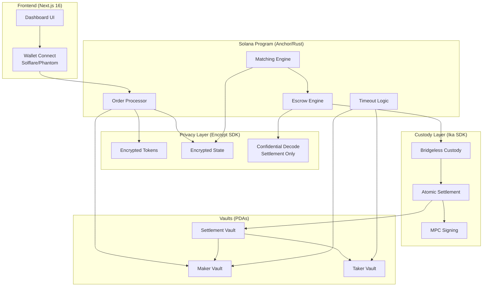

# Civa (CipherVault) — Technical Architecture

## Tech Stack

| Layer | Technology | Rationale |
|---|---|---|
| **Smart Contract** | Anchor (Rust) on Solana | Standard Solana program framework; Adevar audits Rust |
| **Privacy** | Encrypt SDK (Confidential Tokens) | Encrypted state for order parameters |
| **Custody** | Ika SDK (Bridgeless Custody) | Atomic settlement without intermediaries |
| **Frontend** | Next.js 16, React 19 | Fast dashboard UI |
| **Styling** | Tailwind CSS v4 | Dark mode, terminal aesthetic |
| **Charts** | Recharts | Settlement latency visualization |
| **Testing** | Anchor test suite + Jest | 100+ tests target |
| **Deploy** | Vercel (frontend) + Solana Devnet → Mainnet | Progressive deployment |

## System Architecture



## Smart Contract Architecture

### Programs (Anchor)

#### 1. `civa` (Main Program)

**Instructions:**

| Instruction | Description | Accounts |
|---|---|---|
| `create_order` | Maker creates encrypted OTC order | maker, maker_vault, order_state, encrypt_state |
| `cancel_order` | Maker cancels unfilled order | maker, maker_vault, order_state |
| `submit_intent` | Taker submits encrypted matching intent | taker, taker_vault, intent_state, encrypt_state |
| `execute_settlement` | Atomically settles matched order | maker_vault, taker_vault, settlement, ika_custody |
| `claim_timeout` | Refunds locked funds after expiry | claimer, vault, order_state, clock |
| `update_admin` | Multi-sig admin update (timelocked) | admin_multisig, program_config |

**Account States:**

```rust
#[account]
pub struct OrderState {
    pub maker: Pubkey,              // 32
    pub maker_vault: Pubkey,        // 32
    pub encrypted_amount: [u8; 64], // Encrypt SDK cipher
    pub encrypted_price: [u8; 64],  // Encrypt SDK cipher
    pub liquidity_band: u8,         // Public: 0=<100K, 1=100K-1M, 2=1M-5M, 3=5M+
    pub token_mint: Pubkey,         // 32 (SOL or USDC mint)
    pub expiry: i64,                // Unix timestamp
    pub status: OrderStatus,        // 1 byte
    pub created_at: i64,            // 8
    pub bump: u8,                   // 1
}

#[account]
pub struct IntentState {
    pub taker: Pubkey,
    pub encrypted_amount: [u8; 64],
    pub encrypted_max_price: [u8; 64],
    pub target_band: u8,
    pub expiry: i64,
    pub status: IntentStatus,
    pub matched_order: Option<Pubkey>,
    pub bump: u8,
}

#[account]
pub struct SettlementState {
    pub order: Pubkey,
    pub intent: Pubkey,
    pub maker_vault: Pubkey,
    pub taker_vault: Pubkey,
    pub ika_custody_id: [u8; 32],
    pub status: SettlementStatus,
    pub settled_at: Option<i64>,
    pub bump: u8,
}

#[account]
pub struct ProgramConfig {
    pub admin: Pubkey,              // Multi-sig admin
    pub fee_bps: u16,               // Settlement fee in basis points
    pub min_timeout: i64,           // Minimum order timeout (1 hour)
    pub max_timeout: i64,           // Maximum order timeout (24 hours)
    pub paused: bool,               // Emergency pause
    pub timelock_delay: i64,        // Admin action delay (24h)
    pub bump: u8,
}
```

**Enums:**

```rust
#[derive(AnchorSerialize, AnchorDeserialize, Clone, PartialEq)]
pub enum OrderStatus {
    Active,
    Matched,
    Settled,
    Cancelled,
    Expired,
}

#[derive(AnchorSerialize, AnchorDeserialize, Clone, PartialEq)]
pub enum SettlementStatus {
    Pending,
    Executing,
    Completed,
    Failed,
    Refunded,
}
```

### Security Constraints (Anchor)

```rust
// Every instruction checks:
#[access_control(not_paused(&ctx.accounts.config))]
pub fn create_order(ctx: Context<CreateOrder>, params: CreateOrderParams) -> Result<()> {
    require!(params.expiry > Clock::get()?.unix_timestamp, CipherError::ExpiredOrder);
    require!(params.expiry <= Clock::get()?.unix_timestamp + ctx.accounts.config.max_timeout, CipherError::TimeoutTooLong);
    // ... encrypted state via Encrypt CPI
}

// Timeout claims check:
pub fn claim_timeout(ctx: Context<ClaimTimeout>) -> Result<()> {
    let clock = Clock::get()?;
    require!(clock.unix_timestamp > ctx.accounts.order.expiry, CipherError::NotExpiredYet);
    require!(ctx.accounts.order.status == OrderStatus::Active, CipherError::OrderNotActive);
    // ... refund logic
}
```

## Database Schema (Supabase — Off-Chain Index)

```sql
-- Off-chain index for dashboard queries (NOT the source of truth — chain is)
CREATE TABLE orders (
    id UUID PRIMARY KEY DEFAULT gen_random_uuid(),
    order_pubkey TEXT UNIQUE NOT NULL,
    maker_wallet TEXT NOT NULL,
    liquidity_band SMALLINT NOT NULL,
    token_mint TEXT NOT NULL,
    status TEXT NOT NULL DEFAULT 'active',
    expiry TIMESTAMPTZ NOT NULL,
    created_at TIMESTAMPTZ DEFAULT NOW(),
    settled_at TIMESTAMPTZ,
    tx_signature TEXT
);

CREATE TABLE settlements (
    id UUID PRIMARY KEY DEFAULT gen_random_uuid(),
    settlement_pubkey TEXT UNIQUE NOT NULL,
    order_pubkey TEXT NOT NULL REFERENCES orders(order_pubkey),
    maker_wallet TEXT NOT NULL,
    taker_wallet TEXT NOT NULL,
    status TEXT NOT NULL DEFAULT 'pending',
    settled_at TIMESTAMPTZ,
    tx_signature TEXT
);

-- RLS: Users can only see their own orders/settlements
ALTER TABLE orders ENABLE ROW LEVEL SECURITY;
CREATE POLICY "Users see own orders" ON orders
    FOR SELECT USING (maker_wallet = auth.jwt() ->> 'wallet');

ALTER TABLE settlements ENABLE ROW LEVEL SECURITY;
CREATE POLICY "Users see own settlements" ON settlements
    FOR SELECT USING (
        maker_wallet = auth.jwt() ->> 'wallet' OR
        taker_wallet = auth.jwt() ->> 'wallet'
    );
```

## API Endpoints (Next.js API Routes)

| Method | Path | Description |
|---|---|---|
| GET | `/api/orders` | List active orders (liquidity bands only) |
| GET | `/api/orders/mine` | List user's own orders (authenticated) |
| GET | `/api/settlements/mine` | List user's settlements (authenticated) |
| GET | `/api/stats` | Protocol stats (TVL, volume, settlement count) |
| POST | `/api/index/order` | Webhook: index new order from chain events |
| POST | `/api/index/settlement` | Webhook: index settlement from chain events |

## Key Libraries

| Library | Version | Purpose |
|---|---|---|
| `@coral-xyz/anchor` | ^0.30 | Solana program framework |
| `@encrypt-sdk/core` | latest | Confidential token operations |
| `@ika-sdk/custody` | latest | Bridgeless custody integration |
| `@solana/web3.js` | ^2.0 | Solana client |
| `@solana/spl-token` | latest | Token operations |
| `next` | ^16 | Frontend framework |
| `recharts` | ^2.x | Settlement charts |
| `@supabase/supabase-js` | ^2.x | Off-chain index |

## Boilerplate Recommendation

No exact match in `boilerplates.json`. Recommended approach:
```bash
# Frontend
npx -y create-next-app@latest ./frontend --ts --app --tailwind --eslint --src-dir

# Solana Program
anchor init civa --typescript
```

## Model Selection

N/A — Civa is a pure smart contract protocol with no ML models. Security complexity comes from cryptographic primitives (Encrypt SDK) and custody mechanics (Ika SDK), not machine learning.
